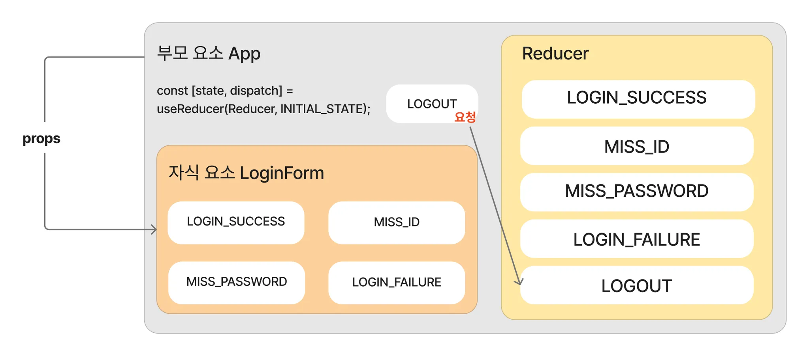

# useReducer / useContext 활용 예제

## useReducer의 문제점

: props drilling 문제가 있을 수 있다.


어제 저희가 작성한 예제에서 LoginForm 컴포넌트에서 state와 dispatch를 사용하기 위해 App 컴포넌트에서부터 props로 값을 내려보내줘야 했습니다.

```jsx
function App() {

  const [ state, dispatch ] = useReducer(Reducer, { isLogin: false, message : '', })  // 여기서 선언했고

  return (
    <div>
      {state.isLogin ? (
        <>
          <strong>welcome 🎈</strong>
          <button onClick={() => dispatch({type: "LOGOUT"})}>로그아웃</button>
        </>
      ) : (
        <LoginForm state={state} dispatch={dispatch} />   // 여기로 내려보내준 것을 이미지화했습니다.
      )}
    </div>
  );
}
```

이상의 코드가 App 컴포넌트에서 useReducer를 통해 생성한 state / dispatch를 LoginForm이라는 자식 컴포넌트에 전달한 코드 사례에 해당합니다.
그렇다면 상태관리도 하면서 props drilling의 문제를 해결하려면 어떡해야 할까?
-> useContext를 사용하면 된다.


이상의 이미지는 props drilling의 대표적은 도식화에 해당합니다. 즉 단계적으로 일일이 props를 넘겨줌으로써 해당 props를 사용하지 않는 컴포넌트 들에도 데이터가 제공되는 문제가 있습니다.

다만 저희는 부모에서 정의하고 바로 자식 컴포넌트에서 사용했습니다.

